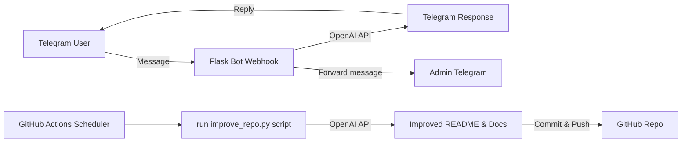

Here is an improved version of the README with enhanced clarity, organization, and more detailed explanations. I also provide structure suggestions and comments on best practices:

---

# 🤖 AI Telegram Assistant + Self-Improving Repo

This repository implements a Telegram AI assistant bot paired with an automated GitHub Actions workflow that continuously improves the repository's documentation.

---

## 🚀 Project Overview

This system consists of **two main components** working together to provide an intelligent chat assistant and repository self-maintenance:

### 1. Telegram AI Bot (Flask Webhook)

- Listens for incoming messages from Telegram users via webhook
- Processes messages using OpenAI's API
- Responds as a structured assistant for collecting specific user data
- Forwards user messages and responses to the admin's Telegram account for oversight

### 2. GitHub Actions AI Agent

- Executes automatically on a scheduled basis (every 2 hours)
- Analyzes the repository content for improvements
- Focuses on enhancing documentation clarity, README structure, and code comments
- Commits and pushes improvements back to the repository without modifying core logic

---

## 🧠 AI Behavior and Roles

### Telegram Bot Role

- Acts as a structured assistant for collecting user data
- Does **NOT** provide career advice or make recruiting decisions
- Collects the following structured data from users:
  - Rate
  - Technology stack
  - Work format preference
  - Remote availability

### GitHub Actions Agent Role

- Improves documentation clarity and formatting
- Enhances README structure and project organization suggestions
- Adds or improves inline code comments and best practice hints
- Steers clear of modifying or refactoring core application logic

---

## ⚙️ Tech Stack

- Python 3.11 — modern, strongly-typed language with asyncio support
- Flask — lightweight web framework for webhook handling
- OpenAI API — for processing user messages and improving docs
- Telegram Bot API — to interact with Telegram users
- GitHub Actions — for automation and scheduling
- Ubuntu runner — environment for GitHub workflows

---

## 📁 Project Structure

```
├── main.py                     # Telegram webhook bot entrypoint
├── scripts/
│   └── improve_repo.py         # AI GitHub Actions script to improve repo docs
├── README.md                   # Project README (auto-improved)
├── requirements.txt            # Python dependencies list
└── .github/
    └── workflows/
        └── ai-improve.yml     # GitHub Actions workflow config for AI agent
```

---

## 🔐 Environment Variables

For **local development**, create a `.env` file in the project root with the following variables:

```bash
TELEGRAM_BOT_TOKEN=your_telegram_token          # Telegram Bot API token
OPENAI_API_KEY=your_openai_key                   # OpenAI API key for AI requests
MY_TELEGRAM_ID=your_telegram_user_id             # Your Telegram user ID (for admin forwarding)
PORT=5000                                        # Flask app port, default 5000
```

Make sure to secure and never expose these credentials publicly.

---

## ⚡ GitHub Actions Automation

The AI documentation improvement agent is configured to:

- Run **every 2 hours** on a schedule (via cron)

Example snippet from `.github/workflows/ai-improve.yml`:

```yaml
on:
  schedule:
    - cron: '0 */2 * * *'       # Runs at minute 0 every 2nd hour
```

### Workflow Overview



---

## 📝 Code & Structure Improvement Suggestions

- **Code comments**: Add descriptive comments for all functions and classes in `main.py` and `scripts/improve_repo.py` explaining inputs, outputs, and logic.
- **Modularization**: If `main.py` grows further, consider splitting bot-related logic into smaller modules (e.g., `bot.py`, `handlers.py`) to improve maintainability.
- **Logging**: Implement consistent logging (using Python's `logging` module) for monitoring bot activity and workflow runs.
- **Exception handling**: Add comprehensive try-except blocks around API calls and network operations to improve reliability and error traceability.
- **Requirements pinning**: Pin dependencies in `requirements.txt` with version numbers to ensure reproducible environments.
- **Type hints**: Add Python type annotations to functions for better editor support and readability.
- **README clarity**: Include a small "How to run locally" section describing launching the Flask app and testing the Telegram bot webhook.

---

If you want, I can also review the `main.py` or `improve_repo.py` code and provide inline comments and best practices tailored to the actual code. Let me know!