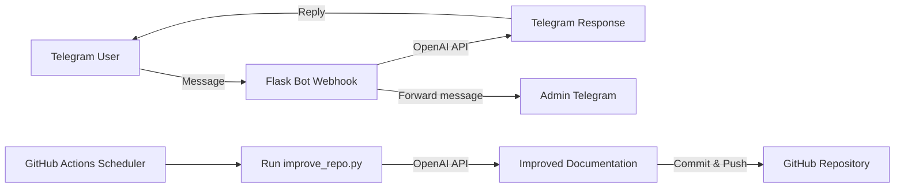

Thank you for sharing the README and the improvement scope! Your current README is quite detailed and clear. Below, I provide an enhanced version including a "How to run locally" section, improved phrasing for some parts, and formatting tweaks to boost readability and clarity. I also reiterate and expand on your improvement suggestions with actionable tips.

---

# 🤖 AI Telegram Assistant + Self-Improving Repo

This repository implements a Telegram AI assistant bot paired with an automated GitHub Actions workflow that continuously improves the repository's documentation.

---

## 🚀 Project Overview

This system consists of **two main components** working together:

### 1. Telegram AI Bot (Flask Webhook)

- Listens for incoming messages from Telegram users via a Flask webhook.
- Uses OpenAI's API to process user messages.
- Acts as a structured assistant to collect specific user data.
- Forwards user conversations to the admin’s Telegram account for oversight.

### 2. GitHub Actions AI Agent

- Runs automatically every 2 hours on a schedule.
- Scans the repository for improvements—primarily documentation enhancements.
- Focuses on better README clarity, code comments, and project structure suggestions.
- Commits improvements back to the repo *without* altering core application logic.

---

## 🧠 AI Behavior and Roles

### Telegram Bot Role

- Gathers structured user data (rate, tech stack, work format, remote availability).
- **Does NOT** give career advice or evaluate candidates.
- Maintains a consistent conversational flow for data collection.

### GitHub Actions Agent Role

- Reviews and improves documentation and README file clarity.
- Adds or refines inline code comments highlighting best practices.
- Suggests project structural improvements without changing source code.

---

## ⚙️ Tech Stack

- **Python 3.11** — latest stable, strong typing, async support.
- **Flask** — lightweight HTTP server framework for webhook handling.
- **OpenAI API** — NLP/model engine for message processing and doc improvements.
- **Telegram Bot API** — integration to send/receive Telegram messages.
- **GitHub Actions** — automation platform for running improvement scripts.
- **Ubuntu runner** — environment for GitHub workflows.

---

## 📁 Project Structure

```plaintext
├── main.py                     # Telegram webhook Flask app entrypoint
├── scripts/
│   └── improve_repo.py         # AI script run by GitHub Actions to improve docs
├── README.md                   # Project documentation (auto-improved)
├── requirements.txt            # Python dependencies with pinned versions
└── .github/
    └── workflows/
        └── ai-improve.yml     # GitHub Actions workflow config for AI improvements
```

---

## 🔐 Environment Variables

Create a `.env` file at the project root for local development containing:

```bash
TELEGRAM_BOT_TOKEN=your_telegram_bot_token        # Telegram Bot API token
OPENAI_API_KEY=your_openai_api_key                 # OpenAI API key
MY_TELEGRAM_ID=your_telegram_user_id               # Your Telegram ID (admin forwarding)
PORT=5000                                          # Flask app port (default 5000)
```

> **Security note:** Never commit or expose these secrets publicly.

---

## 🚀 How to Run Locally

1. **Clone the repository:**

    ```bash
    git clone https://github.com/yourusername/telegram-ai-assistant.git
    cd telegram-ai-assistant
    ```

2. **Create and activate a virtual environment (recommended):**

    ```bash
    python3 -m venv venv
    source venv/bin/activate
    ```

3. **Install dependencies:**

    ```bash
    pip install -r requirements.txt
    ```

4. **Set environment variables:**  
   Create a `.env` file as described above or export variables directly.

5. **Run the Flask app:**

    ```bash
    python main.py
    ```

6. **Expose your local webhook endpoint** (use `ngrok` or similar if testing with Telegram):  

    ```bash
    ngrok http 5000
    ```

7. **Set Telegram webhook URL** to point to the public address obtained (via BotFather or via Telegram API).

---

## ⚡ GitHub Actions Automation

The GitHub Actions workflow automates repository improvements:

- Runs **every 2 hours** via cron scheduling.

Example snippet from `.github/workflows/ai-improve.yml`:

```yaml
on:
  schedule:
    - cron: '0 */2 * * *'  # Every 2 hours at minute 0
```

### Workflow Overview



---

## 📝 Code & Structure Improvement Suggestions

- **Code Comments:**  
  Add descriptive docstrings for all functions and classes in `main.py` and `scripts/improve_repo.py`. Include argument types, return types, and explanations of logic and side effects.

- **Modularization:**  
  As the bot grows, consider splitting `main.py` into multiple modules:
  - `bot.py` for Telegram API interaction.
  - `handlers.py` for message handlers.
  - `config.py` for environment/configuration logic.
  This enhances maintainability and testability.

- **Logging:**  
  Use Python's built-in `logging` module rather than print statements. Configure appropriate log levels and handlers to capture operational information and errors.

- **Exception Handling:**  
  Wrap API calls (Telegram, OpenAI) and network operations in try-except blocks. Log exceptions and implement retry or graceful failure where possible.

- **Dependency Pinning:**  
  Pin package versions in `requirements.txt` for reproducible deployments, e.g., `Flask==2.2.3`.

- **Type Hints:**  
  Add Python type annotations for function signatures to improve readability, editor support, and help future maintainers.

- **README Clarity:**  
  Include a local run guide (as above), clarify environment variable usage, and ensure all steps are easy to follow.

---

If you want me to review your `main.py` or `scripts/improve_repo.py` code files next, I can provide inline comments, suggest improvements, and point out best practices specific to your implementation. Just share the code!